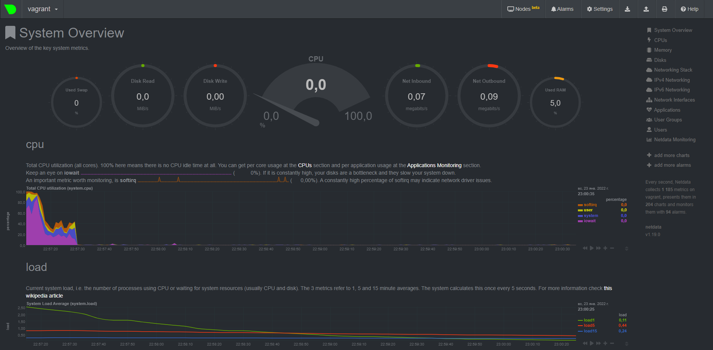

# devops-netology
**Домашнее задание к занятию «2.1. Системы контроля версий.»**  

В будущем благодаря добавленному файлу .gitignore в директории Terraform при использовании команды commit внутри директории terraform, будут игнорироваться файлы и директории перечисленные в .gitignore.  
Какие файлы и директории будут игнорироваться согласно настройкам */Terraform/.gitignore:  
  
* поддиректории .terraform и все вложенные в нее директории, файлы   
`**/.terraform/*`  
* файлы расположенные в корне и поддиректориях с расширением .tfstate или файлы вида *.tfstate.*, пример qwe.tfstate.eqw  
`*.tfstate, *.tfstate.*`  
* файлы расположенные в корне и поддиректориях с именем crash.log  
`crash.log`  
* файлы расположенные в корне и поддиректориях с расширением .tfvars  
`*.tfvars`  
* файлы расположенные в корне и поддиректориях вида override.tf, override.tf.json, *_override.tf, *_override.tf.json  
`override.tf, override.tf.json, *_override.tf, *_override.tf.json`  
* если бы это строчка не начиналась с символа # (комментарий), то работало бы исключение игнорирования файлов example_override.tf     
`# !example_override.tf`
* конфигурационные файлы с расширением .terraformrc и файлы terraform.rc  
`.terraformrc, terraform.rc`   
  

  **Домашнее задание к занятию «2.4. Инструменты Git»**  
1. **git show aefea**  
aefead2207ef7e2aa5dc81a34aedf0cad4c32545
Update CHANGELOG.md
2. **git show 85024d3**  
tag: v0.12.23
3. **git show b8d720^ & git show b8d720^2**  
Двое родителей  
56cd7859e05c36c06b56d013b55a252d0bb7e158  
9ea88f22fc6269854151c571162c5bcf958bee2b  
4. **git log v0.12.24...v0.12.23 --oneline**  
33ff1c03b (tag: v0.12.24) v0.12.24  
b14b74c49 [Website] vmc provider links  
3f235065b Update CHANGELOG.md  
6ae64e247 registry: Fix panic when server is unreachable  
5c619ca1b website: Remove links to the getting started guide's old location  
06275647e Update CHANGELOG.md  
d5f9411f5 command: Fix bug when using terraform login on Windows  
4b6d06cc5 Update CHANGELOG.md  
dd01a3507 Update CHANGELOG.md  
225466bc3 Cleanup after v0.12.23 release  
5. **git grep -n 'func globalPluginDirs('**  
8c928e83589d90a031f811fae52a81be7153e82f
6. **git grep -n 'func globalPluginDirs('**  
Нашел файл, где содержится функция.  
**git log --oneline -L :globalPluginDirs:plugins.go**  
Произвел поиск изменения функции globalPluginDirs в файле plugins.go  
78b122055 Remove config.go and update things using its aliases  
52dbf9483 keep .terraform.d/plugins for discovery  
41ab0aef7 Add missing OS_ARCH dir to global plugin paths  
8364383c3 Push plugin discovery down into command package 
7. **git log -S 'synchronizedWriters'**  
Нашел коммиты, когда данное выражение было добавлено или удалено  
Author: Martin Atkins <mart@degeneration.co.uk>    

**Домашнее задание к занятию "3.1. Работа в терминале, лекция 1"**
1. Как добавить оперативной памяти или ресурсов процессора виртуальной машине?
Отредактировать файл Vagrantfile:
``` 
config.vm.provider "virtualbox" do |v|
  v.memory = N
  v.cpus = X
end  
```
2. Какой переменной можно задать длину журнала history, и на какой строчке manual это описывается?  
`HISTSIZE (3011, 3012)`
3. Что делает директива ignoreboth в bash?  
`Значение для переменной HISTCONTROL. Запрещает запись в историю команд, которые начинаются с пробела или дублирующих предыдущую команду`
4. В каких сценариях использования применимы скобки {} и на какой строчке man bash это описано?  
```
{} используются в описании различных функций, циклов, массивов. Для нас интересен сценарий использования {}, например:  
   echo a{1,2,3} 
   a1 a2 a3
   В фигурных скобках описывается список возможных вариантов, возможно гибкое применение с различными командами. 
   Описывается в 1091 строке.
```
5. С учётом ответа на предыдущий вопрос, как создать однократным вызовом touch 100000 файлов? Получится ли аналогичным образом создать 300000? Если нет, то почему?
```
Команда touch file{1..100000} будет работать, команда touch file{1..300000} не сработает, т.к. количество аргументов в одной команде будет превышать значение переменной ARG_MAX, можно обойти несколькими способами. 
```
6. В man bash поищите по /\[\[. Что делает конструкция [[ -d /tmp ]]  
`Конструкция [[ -d /tmp ]] проверяет наличие каталога tmp`
7. Добейтесь в выводе type -a bash в виртуальной машине наличия первым пунктом в списке:  
bash is /tmp/new_path_directory/bash  
```
mkdir /tmp/new_path_directory/  
cp /bin/bash /tmp/new_path_directory/  
PATH=/tmp/new_path_directory/:$PATH
```
8. Чем отличается планирование команд с помощью batch и at?
```
At выполняет команду в определенное время
Batch выполняет задание, если позволяет уровень загрузки ОС, задания по умолчанию выполняются, если загрузка ОС ниже 1.5.
```

**Домашнее задание к занятию "3.1. Работа в терминале, лекция 2"**

1. Какого типа команда cd? Попробуйте объяснить, почему она именно такого типа; опишите ход своих мыслей, если считаете что она могла бы быть другого типа.  
```
Команда CD встроена в командную оболочку shell, бывают еще команды расположенные в директориях /bin, /usr/bin.
```
2. Какая альтернатива без pipe команде grep <some_string> <some_file> | wc -l?  
```
grep <some_string> <some_file> -c
```  
3. Какой процесс с PID 1 является родителем для всех процессов в вашей виртуальной машине Ubuntu 20.04?
```
systemd
```
4. Как будет выглядеть команда, которая перенаправит вывод stderr ls на другую сессию терминала?
```
ls qq 2> /dev/pts/1
```
5. Получится ли одновременно передать команде файл на stdin и вывести ее stdout в другой файл? Приведите работающий пример.
```
asalnikov@vagrant:~$ nano in
asalnikov@vagrant:~$ cat in
123
123
123
asalnikov@vagrant:~$ cat < in > out
asalnikov@vagrant:~$ cat out
123
123
123
```
6. Получится ли вывести находясь в графическом режиме данные из PTY в какой-либо из эмуляторов TTY? Сможете ли вы наблюдать выводимые данные?
```
Находясь в графическом режиме ввожу команду:
ll > /dev/pts/0
В окне консоли, где я подключен к ВМ по ssh получаю вывод команды ll отправленные из PTY.

```
7. Выполните команду bash 5>&1. К чему она приведет? Что будет, если вы выполните echo netology > /proc/$$/fd/5? Почему так происходит?
```
Первая команда создаст файловый дескриптор 5 и перенаправит его в стандартный stdout. 
Вторая команда выведет на экран netology, т.к. мы направили в дескриптор 5 команду вывести netology, а дескриптор 5 был ранее направлен в stdout.
Если выполнить echo netology > /proc/3454/fd/5 из другой сессии, то echo netology уйдет в сессию, где pid bash 3454.
```
8. Получится ли в качестве входного потока для pipe использовать только stderr команды, не потеряв при этом отображение stdout на pty? Напоминаем: по умолчанию через pipe передается только stdout команды слева от | на stdin команды справа. Это можно сделать, поменяв стандартные потоки местами через промежуточный новый дескриптор, который вы научились создавать в предыдущем вопросе.
```
Если создать специальные условия, то команда ls может выдать информацию по 1 и 2 стандартному потоку. В директории, где будет выполняться команда существует файл 1, но не существует файл 2.
ll 1 2 10>&2 2>&1 1>&10 | grep access
Команда выдала в stdout информацию о файле 1 и передала на stdin грепа вывод из stderror.
1:
ls: cannot access '2': No such file or directory
total 8
drwxrwxr-x 2 asalnikov asalnikov 4096 Jan 15 19:13 ./
drwxrwxr-x 3 asalnikov asalnikov 4096 Jan 15 19:15 ../
```
9. Что выведет команда cat /proc/$$/environ? Как еще можно получить аналогичный по содержанию вывод?
```
В файле environ находятся переменные среды. Нужную информацию можно получить с помощью команды env.
```
10. Используя man, опишите что доступно по адресам /proc/<PID>/cmdline, /proc/<PID>/exe.
```
/proc/<PID>/cmdline содержит команду с помощью которой был запущен процесс и переданные ей параметры.
/proc/<PID>/exe символьная ссылка, которая содержит путь к исполняемому файлу. Можно посмотреть через ls -l.
```
11. Узнайте, какую наиболее старшую версию набора инструкций SSE поддерживает ваш процессор с помощью /proc/cpuinfo.
```
SSE4.2
```
12. При открытии нового окна терминала и vagrant ssh создается новая сессия и выделяется pty. Это можно подтвердить командой tty, которая упоминалась в лекции 3.2. Однако:
```
vagrant@netology1:~$ ssh localhost 'tty'
not a tty
```
Почитайте, почему так происходит, и как изменить поведение.
```
При выполнении команды ssh localhost 'tty' не выделяется TTY. Сможет помочь ключ -t, который выделит терминал для команды.
```
13. Бывает, что есть необходимость переместить запущенный процесс из одной сессии в другую. Попробуйте сделать это, воспользовавшись reptyr. Например, так можно перенести в screen процесс, который вы запустили по ошибке в обычной SSH-сессии.
```
Установил программу, запустил htop в фоне, в другом терминале получил запущенный процесс. 
Столкнулся с ошибкой при выполнении reptyr pid, но вся информация по исправлению была в ошибке.
asalnikov@vagrant:~$ tty
/dev/pts/0
sudo apt-get install reptyr
htop &

asalnikov@vagrant:~$ tty
/dev/tty1
reptyr 4293
```
14. sudo echo string > /root/new_file не даст выполнить перенаправление под обычным пользователем, так как перенаправлением занимается процесс shell'а, который запущен без sudo под вашим пользователем. Для решения данной проблемы можно использовать конструкцию echo string | sudo tee /root/new_file. Узнайте что делает команда tee и почему в отличие от sudo echo команда с sudo tee будет работать.
```
Команда tee принимает стандартный stdin и выводит его в стандартный stdout, и в один или несколько файлов.
Команда echo string | sudo tee /root/new_file будет работать т.к., перенаправление в файл будет выполняться от имени суперпользователя с помощью команды sudo tee.
```

**Домашнее задание к занятию "3.3. Операционные системы, лекция 1"**
1. Какой системный вызов делает команда cd?
```
chdir("/tmp") = 0
Системный вызов chdir с аргументом /tmp.
```
2.Попробуйте использовать команду file на объекты разных типов на файловой системе.  
Используя strace выясните, где находится база данных file на основании которой она делает свои догадки.
```
Файл с "магическими шаблонами" находится по адресу /usr/share/misc/magic.mgc
Дополнительно для анализа библиотек и пакетов использовал команды ldd, dpkg.
```
3. Предположим, приложение пишет лог в текстовый файл. Этот файл оказался удален (deleted в lsof), однако возможности сигналом сказать приложению переоткрыть файлы или просто перезапустить приложение – нет. Так как приложение продолжает писать в удаленный файл, место на диске постепенно заканчивается. Основываясь на знаниях о перенаправлении потоков предложите способ обнуления открытого удаленного файла (чтобы освободить место на файловой системе).
```
asalnikov@vagrant:~$ ping ya.ru > ping &
[10] 16435
asalnikov@vagrant:~$ ll ping
-rw-rw-r-- 1 asalnikov asalnikov 881 Jan 19 17:21 ping
asalnikov@vagrant:~$ rm ping
asalnikov@vagrant:~$ ll ping
ls: cannot access 'ping': No such file or directory
asalnikov@vagrant:~$ sudo lsof | grep ping | grep del
ping      16435                      asalnikov    1w      REG              253,0     9243     526636 /home/asalnikov/ping (deleted)
asalnikov@vagrant:~$ sudo ls -l /proc/16435/fd/1
l-wx------ 1 root root 64 Jan 19 17:23 /proc/16435/fd/1 -> '/home/asalnikov/ping (deleted)'
#Показываю, что файл удален, но процесс продолжает выполнять команду ping
asalnikov@vagrant:~$ sudo cat /proc/16435/fd/1 > ping2 && wc ping2 -l
383 ping2
#обнуляю файл
asalnikov@vagrant:~$ sudo su
root@vagrant:/home/asalnikov# : >/proc/16435/fd/1
#Проверяю, что файл был обнулен
asalnikov@vagrant:~$ sudo cat /proc/16435/fd/1 > ping2 && wc ping2 -l
39 ping2
```
4. Занимают ли зомби-процессы какие-то ресурсы в ОС (CPU, RAM, IO)?
```
Зомби-процессы не занимают ресурсы после перехода в состояние зомби, но занимают PID в таблице процессов.
```
5. На какие файлы вы увидели вызовы группы open за первую секунду работы утилиты opensnoop-bpfcc?
```
Утилита opensnoop-bpfcc отслеживает системный вызов open(). Показывает, какие процессы пытаются открыть какие файлы.
asalnikov@vagrant:~$ sudo opensnoop-bpfcc
PID    COMM               FD ERR PATH
644    dbus-daemon        -1   2 /usr/local/share/dbus-1/system-services
644    dbus-daemon        20   0 /usr/share/dbus-1/system-services
644    dbus-daemon        -1   2 /lib/dbus-1/system-services
644    dbus-daemon        20   0 /var/lib/snapd/dbus-1/system-services/
829    vminfo              4   0 /var/run/utmp
```
6. Какой системный вызов использует uname -a? Приведите цитату из man по этому системному вызову, где описывается альтернативное местоположение в /proc, где можно узнать версию ядра и релиз ОС.
```
Системный вызов uname(). 
Part of the utsname information is also accessible via /proc/sys/kernel/{ostype, hostname, osrelease, version, domainname}.
```
7. Чем отличается последовательность команд через ; и через && в bash?  
Есть ли смысл использовать в bash &&, если применить set -e?
```
&& - логическое И. Вторая команда выполнится только, если первая команда выполнится успешно и вернет 0.
; - просто выполняет несколько команд друг за другом.

Если в скрипте присутствует set -e, то выполнение скрипта из-за ошибки может завершиться раньше чем дело дойдет до строки с &&.
Значит смысл использовать есть.
```
8. Из каких опций состоит режим bash set -euxo pipefail и почему его хорошо было бы использовать в сценариях?
```
-e bash завершает работу, если одна из команд возвращает ненулевое значение
-u при обработке неустановленной переменной (кроме спец переменных @,*) выполнение завершится с выводом в &2. 
Для &? будет дан код ошибки от 1 до 125 и будет рассматриваться, как выполненная
-x выводит в &2 команду до выполнения и после
-o устанавливает ключ для команды по ее длинному имени, например -e = -o errexit.
-o pipefail прекратит выполнение, если одна из частей пайпа завершится ошибкой
Все ключи вместе нужны для удобного создания скрипта, где есть отладка, проверяются ошибки и переменные. 
```
9. Используя -o stat для ps, определите, какой наиболее часто встречающийся статус у процессов в системе.
```
Наиболее часто встречаются процессы S*, которые спят в ожидании завершения некого события и процессы I*, которые являются бездействующими процессами ядра
asalnikov@vagrant:~$ ps axo stat | sort | uniq -c
      7 I
     37 I<
      1 R+
     27 S
      4 S+
      7 S<
      1 Sl
      1 SLsl
      2 SN
      1 S<s
     15 Ss
      2 Ss+
      7 Ssl
      1 STAT
     11 T
```

**Домашнее задание к занятию "3.4. Операционные системы, лекция 2"**  

1. На лекции мы познакомились с node_exporter. В демонстрации его исполняемый файл запускался в background. Этого достаточно для демо, но не для настоящей production-системы, где процессы должны находиться под внешним управлением. Используя знания из лекции по systemd, создайте самостоятельно простой unit-файл для node_exporter:

* поместите его в автозагрузку,
* предусмотрите возможность добавления опций к запускаемому процессу через внешний файл (посмотрите, например, на systemctl cat cron),
* удостоверьтесь, что с помощью systemctl процесс корректно стартует, завершается, а после перезагрузки автоматически поднимается.
```
unit-файл:
[Unit]
Description=node_exporter

[Service]
ExecStart=/home/asalnikov/node_exporter-1.3.1.linux-amd64/./node_exporter $OPT
EnvironmentFile=-/etc/default/node_exporter

[Install]
WantedBy=multi-user.target

Добавил опцию --collector.network_route через внешний файл.
asalnikov@vagrant:~/node_exporter-1.3.1.linux-amd64$ cat /etc/default/node_exporter
OPT="--collector.network_route"

Процесс успешно стартует после перезагрузки и управляется через systemctl.
asalnikov@vagrant:~/node_exporter-1.3.1.linux-amd64$ ps -e | grep node_exporter
    649 ?        00:00:00 node_exporter
asalnikov@vagrant:~/node_exporter-1.3.1.linux-amd64$ systemctl stop node_exporter
==== AUTHENTICATING FOR org.freedesktop.systemd1.manage-units ===
Authentication is required to stop 'node_exporter.service'.
Multiple identities can be used for authentication:
 1.  vagrant
 2.  Salnikov Artem,,, (asalnikov)
Choose identity to authenticate as (1-2): 2
Password:
==== AUTHENTICATION COMPLETE ===
asalnikov@vagrant:~/node_exporter-1.3.1.linux-amd64$ ps -e | grep node_exporter
asalnikov@vagrant:~/node_exporter-1.3.1.linux-amd64$
```
2. Ознакомьтесь с опциями node_exporter и выводом /metrics по-умолчанию. Приведите несколько опций, которые вы бы выбрали для базового мониторинга хоста по CPU, памяти, диску и сети.  
```
CPU:
node_cpu_seconds_total{cpu="0",mode="idle"} 775.41
node_cpu_seconds_total{cpu="0",mode="iowait"} 10.74
node_cpu_seconds_total{cpu="0",mode="system"} 8.06

memory:
node_memory_MemTotal_bytes 4.127342592e+09
node_memory_Cached_bytes 5.28723968e+08
node_memory_Buffers_bytes 5.0151424e+07

disk:
node_filesystem_size_bytes{device="/dev/sda2",fstype="ext4",mountpoint="/boot"} 1.02330368e+09
node_filesystem_free_bytes{device="/dev/sda2",fstype="ext4",mountpoint="/boot"} 9.12084992e+08
node_disk_read_bytes_total{device="sda"} 4.84661248e+08
node_disk_written_bytes_total{device="sda"} 2.740224e+07

network:
node_network_receive_bytes_total{device="eth0"} 1.548348e+06
node_network_transmit_bytes_total{device="eth0"} 219806
```
3. Установите в свою виртуальную машину Netdata. Воспользуйтесь готовыми пакетами для установки (sudo apt install -y netdata). После успешной установки:
После успешной перезагрузки в браузере на своем ПК (не в виртуальной машине) вы должны суметь зайти на localhost:19999
```
Установил ПО Netdata, успешно получил на своем ПК вывод метрик ВМ.

```
4. Можно ли по выводу dmesg понять, осознает ли ОС, что загружена не на настоящем оборудовании, а на системе виртуализации?
```
asalnikov@vagrant:~$ dmesg | grep virt
[    0.003436] CPU MTRRs all blank - virtualized system.
```
5. Как настроен sysctl fs.nr_open на системе по-умолчанию? Узнайте, что означает этот параметр. Какой другой существующий лимит не позволит достичь такого числа (ulimit --help)?
```
sysctl fs.nr_open выводит максимальное количество дескрипторов файлов, которые может выделить процесс. Значение по умолчанию 1024*1024=1048576, считается, что такого значения должно хватать по умолчанию для большинства машин.
Такого числа не позволит достигнуть софт лимит равный 1024, поменять можно c помощью редактирования файла /etc/security/limits.conf, добавить строку asalnikov soft nofile 1048576 
```
6. Запустите любой долгоживущий процесс (не ls, который отработает мгновенно, а, например, sleep 1h) в отдельном неймспейсе процессов; покажите, что ваш процесс работает под PID 1 через nsenter. Для простоты работайте в данном задании под root (sudo -i). Под обычным пользователем требуются дополнительные опции (--map-root-user) и т.д.
```
asalnikov@vagrant:~$ sudo -i
root@vagrant:~# unshare -f --pid --mount-proc sleep 2h &
[1] 1754
root@vagrant:~# ps aux | grep sleep
root        1754  0.0  0.0   5480   532 pts/0    S    21:10   0:00 unshare -f --pid --mount-proc sleep 2h
root        1755  0.0  0.0   5476   528 pts/0    S    21:10   0:00 sleep 2h
root        1758  0.0  0.0   6432   740 pts/0    S+   21:10   0:00 grep --color=auto sleep
root@vagrant:~# nsenter --target 1755 --pid --mount
root@vagrant:/# ps aux
USER         PID %CPU %MEM    VSZ   RSS TTY      STAT START   TIME COMMAND
root           1  0.0  0.0   5476   528 pts/0    S    21:10   0:00 sleep 2h
root           2  0.0  0.1   7236  4164 pts/0    S    21:11   0:00 -bash
root          13  0.0  0.0   8892  3380 pts/0    R+   21:11   0:00 ps aux
```
7. Найдите информацию о том, что такое :(){ :|:& };:. Запустите эту команду в своей виртуальной машине Vagrant с Ubuntu 20.04 (это важно, поведение в других ОС не проверялось). Некоторое время все будет "плохо", после чего (минуты) – ОС должна стабилизироваться. Вызов dmesg расскажет, какой механизм помог автоматической стабилизации. Как настроен этот механизм по-умолчанию, и как изменить число процессов, которое можно создать в сессии?  
```
:(){ :|:& };: - является логической или форк бомбой, которая порождает большое количество рекурсивных процессов и старается заполнить свободные ресурсы.
Судя по выводу dmesg прекратить выполнение помог cgroup, данный механизм похоже прекращает выполнение процессов после достижения определенного числа процессов запущенных одновременно в сессии.
Лимит можно посмотреть в выводе:
asalnikov@vagrant:~$ systemctl status user-1001.slice
● user-1001.slice - User Slice of UID 1001
     Loaded: loaded
    Drop-In: /usr/lib/systemd/system/user-.slice.d
             └─10-defaults.conf
     Active: active since Sun 2022-01-23 20:43:17 UTC; 51min ago
       Docs: man:user@.service(5)
      Tasks: 9 (limit: 10158)
Изменить лимит можно отредактировав файл /usr/lib/systemd/system/user-.slice.d/10-defaults.conf.

```